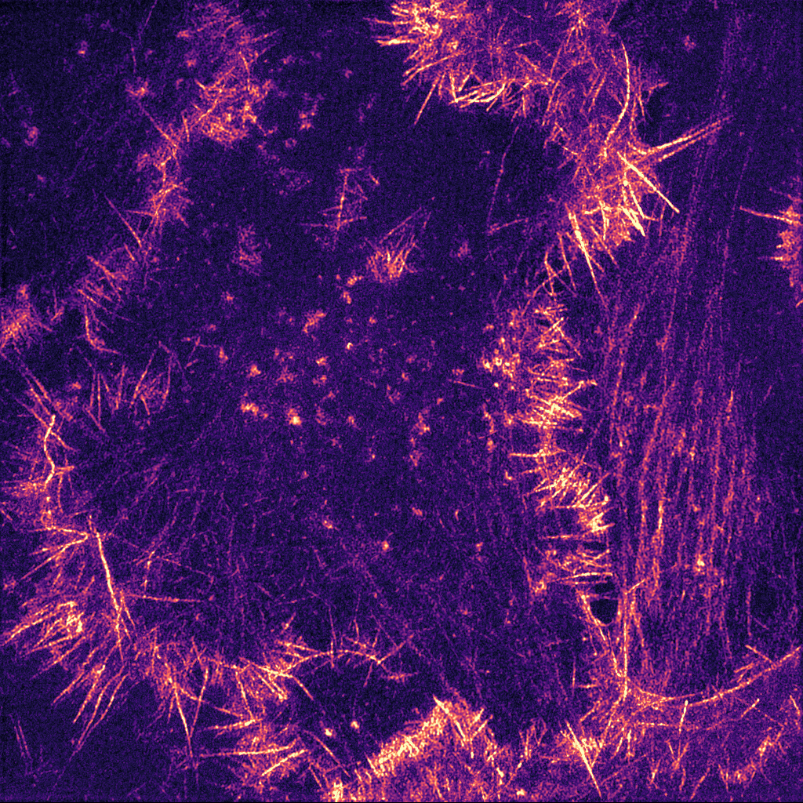
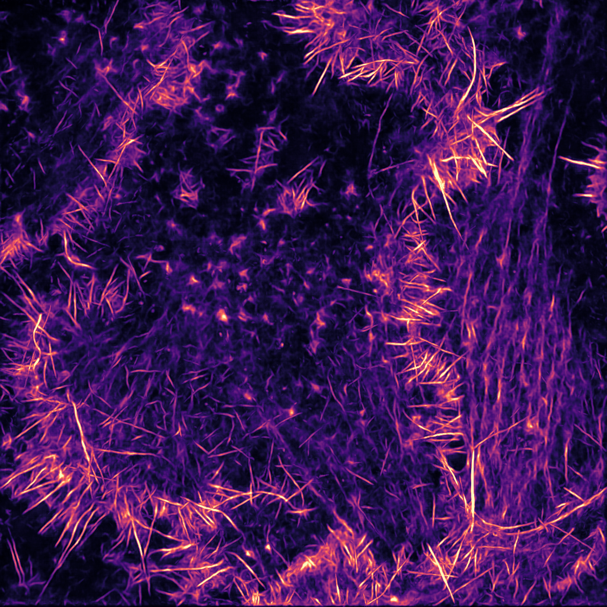
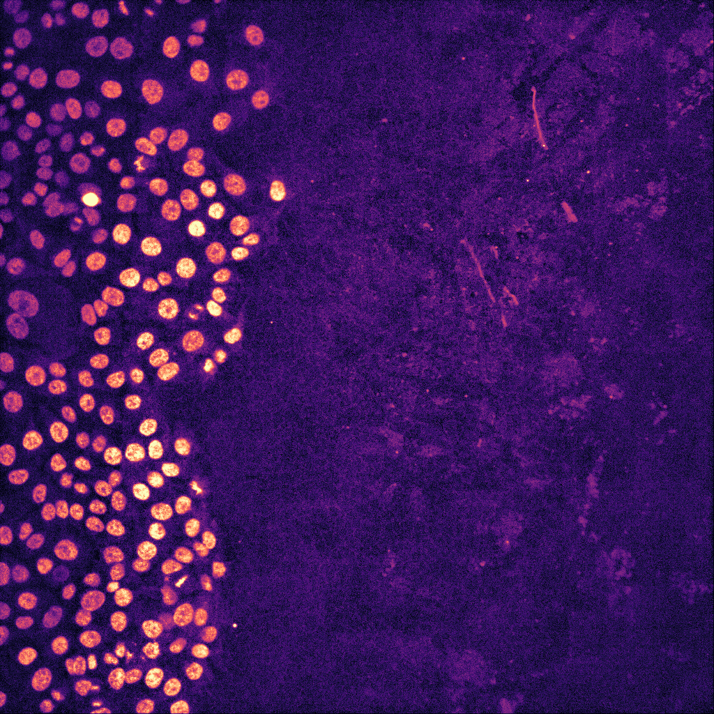
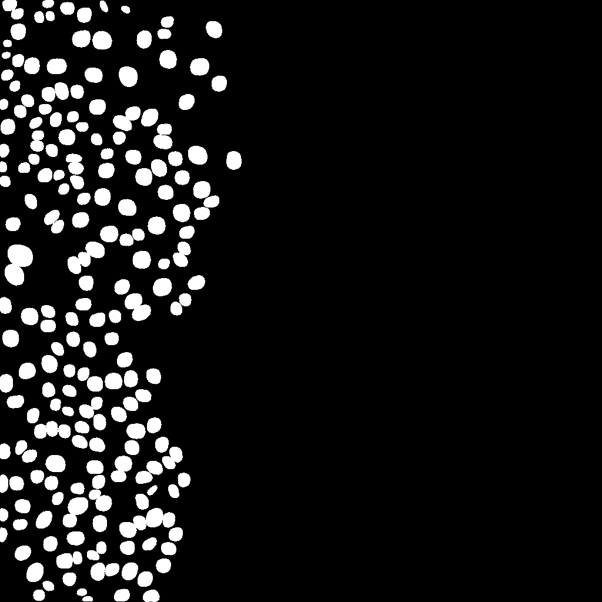
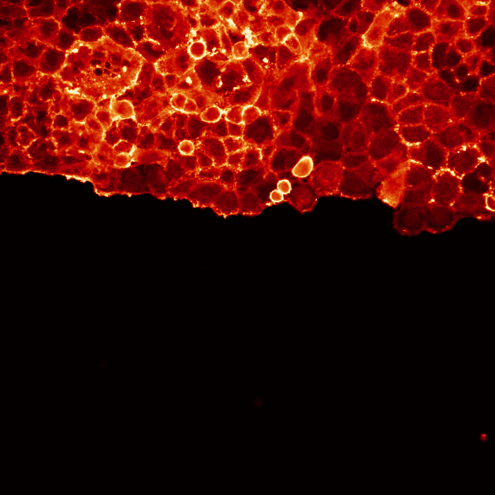
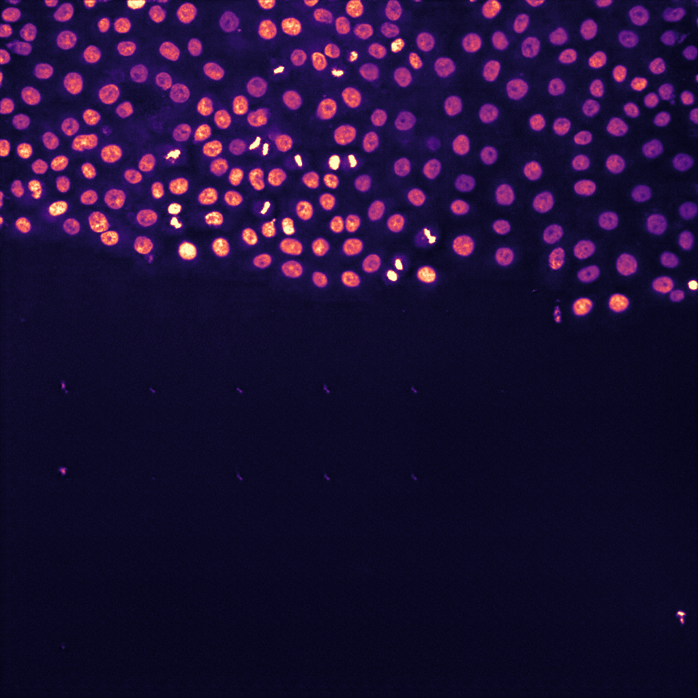

# ZeroCostDL4Mic

## Deep learning to analyse microscopy images

Artificial intelligence (AI)-powered algorithms are now influencing many aspects of our day-to-day life,
from providing movies/music recommendations to controlling self-driving cars. These algorithms are also
increasingly used in the lab to aid biomedical research. In particular, the ability to analyse and process
images using AI is slowly revolutionizing the quality and quantity of data we collect from microscopy
images. In fact, AI-based algorithms can now be applied to perform virtually any high-performance image
analysis tasks such as classifying images, detecting and segmenting objects, aligning images or improving
image quality by removing noise or increasing image resolution.
{: .cm-dropcap }

Read our primer on
“[Deep learning to analyse microscopy images](https://doi.org/10.1042/bio_2021_167)”
published in The Biochemist.

## Democratising deep learning for microscopy with ZeroCostDL4Mic

<video controls preload="none" playsinline poster="../assets/media/zerocostdl4mic.jpg">
  <source src="assets/media/zerocostdl4mic.mp4" type="video/mp4">
</video>

ZeroCostDL4Mic is an entry-level platform simplifying deep learning access by leveraging the free,
cloud-based computational resources of Google Colab. ZeroCostDL4Mic allows researchers with no coding
expertise to train and apply key deep learning networks to perform tasks including segmentation (using U-Net
and StarDist), object detection (using YOLOv2), denoising (using CARE and Noise2Void), super-resolution
microscopy (using Deep-STORM), and image-to-image translation (using label-free prediction – fnet, pix2pix,
and CycleGAN). Importantly, we provide suitable quantitative tools for each network to evaluate model
performance, allowing model optimization.
{: .cm-dropcap }

[Read the ZeroCostDL4Mic paper](https://www.nature.com/articles/s41467-021-22518-0){ .cm-button }
[Use the ZeroCostDL4Mic platform](https://github.com/HenriquesLab/ZeroCostDL4Mic/wiki#fully-supported-networks){ .cm-button .cm-button--ghost }

Drag the slider to compare the input image (left) with the network output (right).

<figure class="cm-compare" markdown>

<figcaption>Image restoration using CSBDeep CARE</figcaption>
</figure>

<figure class="cm-compare" markdown>

<figcaption>Image segmentation using StarDist</figcaption>
</figure>

<figure class="cm-compare" markdown>

<figcaption>Image-to-image translation using pix2pix</figcaption>
</figure>
